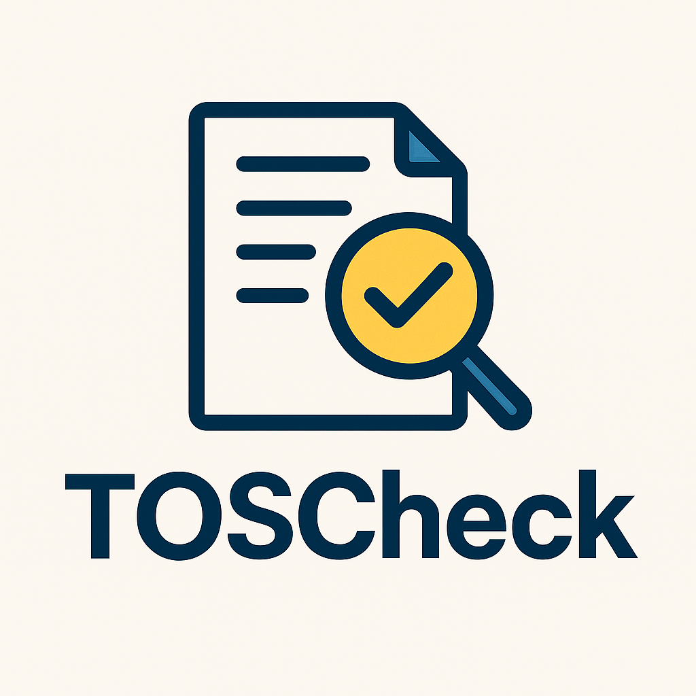

  

# TOSCheck

TOSCheck exists because reading the Terms of Service is important, and most people simply don’t do it.

I’d been bored for a while and wanted something new to build, but this idea stuck after reading a story about a chess player who won $1000 just by reading the Terms and Conditions that everyone else ignored. It’s a funny story, but also a reminder that nobody actually reads the fine print, even though it quietly decides how companies can use your data and what rights you sign away without realizing it.

TOSCheck is my way of doing something about that. It’s a project meant to actually read what people skip. It scans Terms of Service and Privacy Policies, highlights the parts that stand out, and tries to make sense of the text that’s usually written to be ignored. The goal is to make this process easier, fairer, and a little more honest.

I’ve worked on other projects before, like Equigrade, which aimed to make grading fairer in education. That project never really took off. It was finished in fall 2023 and, honestly, never had any active users. The timing didn’t help either. With LLMs becoming common in programming classes, beginner coursework changed quickly. Students could now use AI to write one-line loops or finish entire assignments instantly, so a lot of professors shifted to test-based grading instead.

TOSCheck comes from the same motivation as Equigrade did, wanting to build something that gives people more clarity and control. The difference is that this one is smaller, simpler, and more personal. It is not about creating something huge; it is about building something that should have existed already.

And hopefully, unlike Equigrade, TOSCheck actually ends up with a few users who aren’t just me testing it at random hours and pretending I’m doing research.

Most people don’t read the fine print because it’s long, dull, and often written to be unreadable. But the words matter. They always have. This project is a reminder that understanding what you agree to shouldn’t feel impossible.

If this tool helps even one person stop and actually read what they’re signing, I’ll count that as a win. No promises that it will help you win any money like that chess story, though.

Also, I bet most of you won’t even read this **README**, which is kind of funny considering that’s literally the point of this entire project.

And just to set expectations, TOSCheck isn’t really meant for people who haven’t spent time setting up projects, programming, or using GitHub. It’s not complicated, but it does take a bit of setup. Which, to be fair, can be annoying sometimes, although it’s 2025, so there’s probably an LLM somewhere that will walk you through it anyway.

---

### Why now
Everyone’s using AI tools, but nobody’s reading the fine print that comes with them.  
New apps, new APIs, new “we value your privacy” pop-ups — all of them say something you probably shouldn’t ignore.  
TOSCheck is just a small push toward paying attention again.

---

### What it might flag

**Input**
> “We may change these terms at any time without notice. We may share your information with partners. Disputes will be handled by binding arbitration.”

**Output**
Unilateral changes, Data sharing, Arbitration.  
That’s it — short, direct, and exactly what you need to know.

---

### Privacy
No uploads, no tracking, no servers.  
TOSCheck runs entirely on your device.  
If you share something by accident, that’s on you, not the app.

---

### FAQ

**Does this replace a lawyer?**  
No. It just helps you decide what to ask a lawyer about.

**Will it make me $1000 for reading terms?**  
Unlikely. But it might save you from agreeing to something you don’t want.

**Why local?**  
Because documents like this are private. Also because local is calmer.

**Can I run this without knowing how to code?**  
Technically yes, but practically no. You’ll need to know how to run a Python script. If that sounds intimidating, don’t worry — an LLM will probably hold your hand through it.

**What models does it use?**  
Anything you point it to. You can use a local model through Ollama or an API call if you already have one set up. TOSCheck doesn’t care; it just reads what’s there.

**Is this giving me legal advice?**  
Absolutely not. It’s just summarizing and flagging text that looks odd. You still have to use your own brain (or a lawyer’s).

**Does it store or send my data anywhere?**  
No. Everything happens locally. Nothing leaves your machine unless you explicitly make it leave.

**How accurate is it?**  
Pretty decent. It’s not perfect, but it’ll catch the stuff that stands out — arbitration, vague language, weird data-sharing lines, that kind of thing.

**Why make this at all?**  
Because nobody reads these documents, and yet we agree to them every day. TOSCheck is just one small way to make that habit a little less blind.

**Can I contribute?**  
Sure. Open a pull request or an issue if you think something can be improved. If you break something, at least open an issue about that too.

**Will this ever have a UI?**  
Maybe. For now, the command line is enough. It keeps it quiet and fast, and you feel slightly more like a hacker while reading about arbitration clauses.

**How long does it take to run?**  
Depends on the model and the length of the TOS. Usually under a minute unless you’re using a potato or a 175B model on your laptop.

**Can I use it at work?**  
If you can legally use open-source tools, yes. If not, you might want to check your employer’s tech AUP.

**Will it yell at me for not reading the TOS?**  
No. It’ll just silently judge you, which is somehow worse.

**Can I run it on random apps just for fun?**  
Go for it. You’ll be surprised how many “free” things quietly cost your data.

**Does it work on Privacy Policies too?**  
Yes. In fact, those are usually where the weirdest stuff hides.

---

### For developers
If you’re reading this section, you probably already read the terms before agreeing to GitHub’s API policy. Congrats — you’re already ahead of 99% of people.

---

### Final note
This project isn’t trying to be a big deal. It’s just something small that should have existed already.  
If it makes even one person think before clicking “I agree,” then it did its job.  
And if not, at least I read the terms this time.
