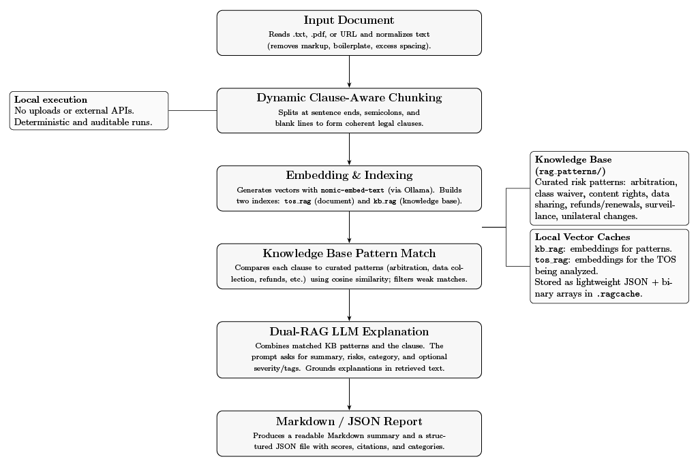

<p align="center">
  
</p>

# TOSCheck

Most people don’t read the Terms of Service, even though that’s where companies quietly decide what they can do with your data, rights, and time.  

TOSCheck exists to make that a little less painful. It scans Terms of Service and Privacy Policies, flags the parts that stand out, and explains them in plain language. The goal is simple: help people actually understand what they’re agreeing to.

The idea came after reading about a chess player who won $1,000 just by reading the fine print everyone else ignored. Funny story, but also proof that nobody really reads this stuff, even when it matters.

I’ve built other projects before, like *Equigrade*, which tried to make grading fairer in education. It never took off, LLMs changed how classes worked, and professors moved on. TOSCheck comes from the same place, though: wanting to build tools that give people clarity and control.  

This one’s smaller, simpler, and personal. It’s not about building something big, just something useful that should’ve existed already.

If this helps someone actually read what they’re agreeing to, that’s enough.  
No promises it’ll win you $1,000 like that chess story, but at least you’ll know what you signed.

And if you’re skimming this README, that’s okay — you’re kind of proving the point.

## Why now

Everyone’s using AI tools, but nobody’s reading the fine print that comes with them.  
New apps, new APIs, new “we value your privacy” pop-ups — all of them say something you probably shouldn’t ignore.  
TOSCheck is just a small push toward paying attention again.

## What it might flag

**Input:**  
> “We may change these terms at any time without notice. We may share your information with partners. Disputes will be handled by binding arbitration.”

**Output:**  
Unilateral changes, Data sharing, Arbitration.  
Short, direct, and exactly what you need to know.

TOSCheck doesn’t just summarize at random, it uses a local LLM (via Ollama or your configured model) to read the text line by line, score each sentence for legal patterns, and cite the lines that triggered each flag.

It looks for things like  
- Unilateral authority: “we can change this whenever we want” 
- Data sharing: “third parties,” “affiliates,” “partners” 
- Binding arbitration or waiver of rights  
- Vague permissions: “for purposes deemed appropriate” 
- Opt-out tricks hidden in the text  

It doesn’t editorialize or moralize, it just points out the weird stuff so you can decide what matters.

## Privacy

No uploads. No tracking. No servers.  
Everything runs entirely on your machine.  
If you accidentally share something, that’s on you, not the app.

## For Developers

If you’re reading this section, you probably already read GitHub’s API Terms before agreeing to them. Congratulations, you’re already ahead of 99% of people.  
If you didn’t, that’s fine too. You’ll fit right in here.

As of right now, I’d recommend this for people who are comfortable with the command line and know a bit of coding.  
You don’t need to be some terminal wizard, but you should at least know how to `cd` into a folder without opening Stack Overflow.  

Everything here is CLI-based for now, and while it’s not *hard*, it definitely *looks* intimidating if you’ve never done it before.  
You can totally figure it out with some patience (and maybe an LLM holding your hand through it), but yeah — this is a dev-friendly zone for now.  
If that ever changes, great. Until then, this one’s for people who don’t mind a terminal window.

## How It Works (Technical Overview)

TOSCheck runs on a local Retrieval-Augmented Generation (RAG) pipeline. It takes a Terms of Service or Privacy Policy, breaks it into meaningful pieces, embeds them, and uses a local model to compare what it finds against known legal risk patterns — all directly on your machine.

### 1. Text Extraction and Normalization
Feed it a text file, a PDF, or a URL.  
`read_text()` handles the cleanup: removing junk, stripping formatting, and leaving behind clean, readable content.

### 2. Clause-Aware Chunking
Instead of chopping text into random parts, TOSCheck uses a custom chunker that understands clauses and sentence structure.  
It splits where it makes sense — after punctuation, newlines, or long semicolons — so each chunk keeps its full meaning.

### 3. Embedding and Indexing
Each chunk is embedded using `nomic-embed-text` through Ollama and stored in `.ragcache` for fast reuse.  
Two embedding spaces are maintained:
- **`tos_rag`** — embeddings for your document  
- **`kb_rag`** — curated knowledge base of legal patterns (like Arbitration, Data Sharing, or Unilateral Changes)

### 4. Retrieval
Each clause is compared to the knowledge base using cosine similarity.  
When something matches closely (e.g. “You waive any right to a jury trial”), it flags that clause as related to a known risk area.

### 5. Contextual Explanation
The matched clauses are then passed to a local or remote LLM, which:
- Summarizes what the clause actually says in plain English  
- Explains why it’s relevant or risky  
- Labels it (like “Arbitration” or “Data Sharing”)  
- Optionally adds a severity tag or score

### 6. Dual-RAG Reasoning
This is where TOSCheck stands out.  
It first retrieves matches from the legal pattern KB, *then* retrieves supporting context from the same document.  
That double grounding keeps explanations accurate and cuts down on hallucination or overreach.

### 7. Report Generation
Once analysis is done, two reports are generated:
- **Markdown (`.md`)** — readable summary with highlighted risks and explanations  
- **JSON (`.json`)** — structured data for automation or integration into other tools

### 8. Local by Default
Everything happens locally — no uploads, no tracking, no hidden API calls.  
If you want cloud inference, you have to opt in yourself. Otherwise, everything stays offline and private.

---

## System Flow

TOSCheck runs like a pipeline — text goes in, insight comes out.

1. **Input Layer** — handles `.txt`, `.pdf`, or URL input via `trafilatura`  
2. **Normalization & Chunking** — cleans and segments content into meaningful clauses  
3. **Embedding & Indexing** — converts chunks to vectors using `nomic-embed-text`  
4. **Knowledge Base Comparison** — finds similar legal clauses using cosine similarity  
5. **Dual-RAG Reasoning** — combines KB and document context for grounded explanations  
6. **Report Generation** — outputs Markdown and JSON summaries

---

## System Architecture

The architecture follows a simple but reliable structure:

```
User Input → Extractor → Chunker → Indexer → Retriever → Explainer → Reporter
```

Each module is independent and testable, making it easy to extend or replace parts of the pipeline.  
For example, you can swap the embedding model, change the RAG cache path, or hook in a different LLM — all with environment variables.

### Environment Configuration

```
MODEL=llama3
EMBED_MODEL=nomic-embed-text
RAG_CACHE_DIR=.ragcache
```

Optional (for cloud use):
```
OPENAI_API_KEY=sk-yourkey
OPENAI_BASE_URL=https://api.openai.com/v1
```

### Cache Metadata

Every run stores a lightweight `meta.json` in `.ragcache` to track:
- Embedding model name and dimensions  
- Hash of vector files  
- Timestamp  
- Version  

If the system detects a mismatch, it’ll automatically re-index to stay consistent.

---

## System Flowchart

Here’s how everything connects under the hood:

<p align="center">
  
</p>

---

In short: TOSCheck is a clean, modular RAG stack that lives entirely on your machine.  
No gimmicks — just a practical way to read what everyone else skips.

## Installation & Setup

All you need is Python and [Ollama](https://ollama.ai), because we like our models where we can see them — on our own machines.

### 1. Clone the repo
```bash
git clone https://github.com/SekenderNaveed1/TOSCheck.git
cd TOSCheck
```

### 2. Set up your environment
```bash
python -m venv .venv
source .venv/bin/activate        # Mac/Linux
.venv\Scripts\activate           # Windows
pip install -r requirements.txt
```

### 3. Install Ollama
TOSCheck runs best with [Ollama](https://ollama.ai).  
Pull a model:
```bash
ollama pull llama3
```

**Hardware tip:** Run it on a GPU if you can.  
If you’re on CPU, expect your fans to go turbo. It still works — just slower.

### 4. Create your `.env`
```
MODEL=llama3
EMBED_MODEL=nomic-embed-text
RAG_CACHE_DIR=.ragcache
```
If you want to use a cloud model:
```
OPENAI_API_KEY=sk-yourkeyhere
```

### 5. Run it
```bash
python -m toscheck.app sample.txt
```

It’ll read, clean, chunk, match, and flag — then give you Markdown and JSON reports:
```
report.md
report.json
```

Example output:
```
[🔍] Analyzing Terms of Service...
Found 3 flagged clauses:
 - "We may change these terms at any time..." → Unilateral Changes
 - "We may share your information with partners." → Data Sharing
 - "Disputes will be handled by binding arbitration." → Arbitration
Report saved to scan_report.md
```

TOSCheck caches embeddings in `.ragcache`, so reruns are instant.  
If things get messy:
```bash
rm -rf .ragcache kb_rag tos_rag
```

## FAQ

**Does this replace a lawyer?**  
No. It just helps you figure out what to ask a lawyer about, assuming you can afford one.

**Will it make me $1000 for reading terms?**  
Probably not. But it might save you from giving away the rights to your data, your ideas, and your soul.

**Why does it run locally?**  
Because privacy tools that send data away make zero sense.  
No servers, no telemetry, no “research analytics.” Everything stays on your machine.

**Can I run this without knowing how to code?**  
Technically yes, practically no.  
If you can type `python -m toscheck.app sample.txt`, you’re good.

**Why the name “TOSCheck”?**  
Because everything cooler was taken. And I refused to name it something with “AI” in it.

**What models does it use?**  
Whatever you point it to — local via Ollama or API if you’re fancy. It doesn’t care.

**Is this giving me legal advice?**  
Absolutely not. It just flags suspicious stuff so you can decide what actually matters.

**Does it store or send my data anywhere?**  
Nope. Everything happens locally.  
If you drag your tax returns in here, that’s on you.

**How accurate is it?**  
Pretty solid.  
It’s not perfect, but it catches the big-ticket stuff — arbitration, vague language, “we may change these terms,” and data sharing.  
I didn’t test it with F1 scores or benchmarks or any of that academic stuff — this isn’t a paper.  
But on real-world docs? It did surprisingly well. Like “wait, that actually worked” levels of good.

**Why make this at all?**  
Because people scroll through “I agree” like muscle memory, and companies count on that.  
People see a small number and stop asking questions, this project exists to make reading the details less painful before it bites you.

**Can I contribute?**  
Sure. PRs, issues, chaos welcome. If you break something, at least tell me how.

**Will this ever have a UI?**  
Maybe. Right now, CLI only, fast, quiet, looks cool. A web UI might come later.

**Can I use it at work?**  
If your job lets you use open-source, yes. If not, maybe read the tech policy. (See? Reading helps.)

**Will it yell at me for not reading the TOS?**  
No, it’ll just silently judge you. Which hurts more.

**Does it work on Privacy Policies too?**  
Yes. That’s actually where the real chaos hides.

**Does it have plans for updates?**  
Yeah — maybe prettier reports, more pattern types, maybe a UI if I get bored again, which I sincerely hope I don’t.

**Is this an “AI startup”?**  
No. It’s not a company. It’s just a project that should’ve existed already.

**What’s the goal?**  
Clarity.  
If one person stops and actually reads before hitting “I agree,” that’s a win.  
If not, at least I read the terms this time.

## Final Note

I didn’t name this something with “AI” on purpose. The word’s everywhere — on products that don’t need it.  
TOSCheck isn’t hype or magic; it just reads what people don’t.  
Testing LLMs paid my bills in Junior year of college, but even then I knew they weren’t the answer to everything.  
This project’s small, local, and practical,  it exists because someone had to build it.
