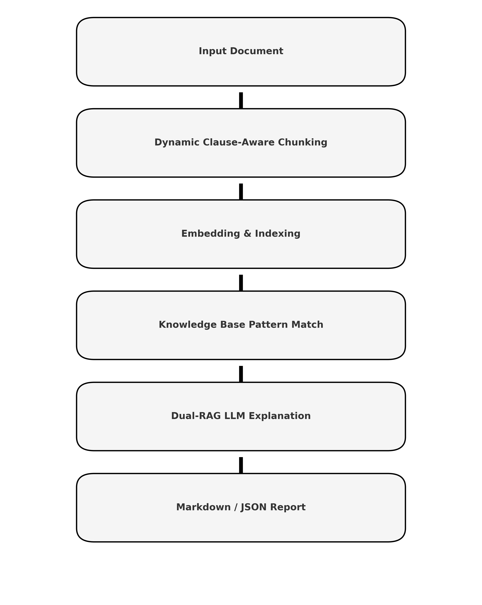

  

# TOSCheck

TOSCheck exists because reading the Terms of Service is important, and most people simply don’t do it.

I’d been bored for a while and wanted something new to build, but this idea stuck after reading a story about a chess player who won $1000 just by reading the Terms and Conditions that everyone else ignored. It’s a funny story, but also a reminder that nobody actually reads the fine print, even though it quietly decides how companies can use your data and what rights you sign away without realizing it.

TOSCheck is my way of doing something about that. It’s a project meant to actually read what people skip. It scans Terms of Service and Privacy Policies, highlights the parts that stand out, and tries to make sense of the text that’s usually written to be ignored. The goal is to make this process easier, fairer, and a little more honest.

I’ve worked on other projects before, like Equigrade, which tried to make grading fairer in education. It was finished in fall 2023 but never really had any users. By then, LLMs had changed how programming classes worked. Students could use AI to write simple loops or even full assignments, so most professors switched to test-based grading instead.

TOSCheck comes from the same motivation as Equigrade did: wanting to build something that gives people more clarity and control. The difference is that this one is smaller, simpler, and more personal. It’s not about creating something huge, it’s about building something that should have existed already.

And hopefully, unlike Equigrade, TOSCheck actually ends up with a few users who aren’t just me testing it at random hours and pretending I’m doing research.

Most people don’t read the fine print because it’s long, dull, and often written to be unreadable. But the words matter. They always have. This project is a reminder that understanding what you agree to shouldn’t feel impossible.

If this tool helps even one person stop and actually read what they’re signing, I’ll count that as a win. No promises that it’ll help you win any money like that chess story, though.

Also, I bet most of you won’t even read this README, which is kind of funny considering that’s literally the point of this entire project.

And just to set expectations, TOSCheck isn’t really meant for people who haven’t spent time setting up projects, programming, or using GitHub. It’s all CLI for now, and let’s be honest, the command line tends to scare off anyone who isn’t from a CS background. It’s not that it’s hard, it just looks like it is. But it’s 2025, so if typing `python main.py` feels intimidating, an LLM somewhere will probably walk you through it anyway.

---

### Why now
Everyone’s using AI tools, but nobody’s reading the fine print that comes with them.  
New apps, new APIs, new “we value your privacy” pop-ups — all of them say something you probably shouldn’t ignore.  
TOSCheck is just a small push toward paying attention again.

---

### What it might flag

**Input**
> “We may change these terms at any time without notice. We may share your information with partners. Disputes will be handled by binding arbitration.”

**Output**  
Unilateral changes, Data sharing, Arbitration.  
That’s it. Short, direct, and exactly what you need to know.

TOSCheck doesn’t just summarize at random. It uses an LLM (via Ollama or your configured model) to read through the text line by line, score each sentence for keywords and legal patterns, and then cite the lines that triggered a flag.  

It looks for things like:
- **Unilateral authority:** phrases that mean the company can change the rules whenever they want.  
- **Data collection and sharing:** anything involving “third parties,” “partners,” or “affiliates.”  
- **Binding arbitration or waiver of rights:** clauses that remove your ability to sue or join a class action.  
- **Undefined or vague permissions:** lines that say things like “we may use your information for purposes deemed appropriate.”  
- **Opt-out tricks:** sections that technically let you refuse something but hide how.  

When it flags something, TOSCheck shows the reason (like “Data sharing”) and where in the text it found it, so you can read it yourself instead of trusting a summary.  

It doesn’t editorialize or make moral judgments. It just points at the weird parts so you can decide what matters.

---

### Privacy
No uploads, no tracking, no servers.  
TOSCheck runs entirely on your device.  
If you share something by accident, that’s on you, not the app.

---

### FAQ

**Does this replace a lawyer?**  
No. It just helps you decide what to ask a lawyer about, if you can even afford one in this economy.

**Will it make me $1000 for reading terms?**  
Unlikely. But it might save you from agreeing to something you don’t want.

**Why local?**  
Because documents like this are private. Also because local is calmer.

**Can I run this without knowing how to code?**  
Technically yes, but practically no. You’ll need to know how to run a Python script. If that sounds intimidating, don’t worry — an LLM will probably hold your hand through it.

**What models does it use?**  
Anything you point it to. You can use a local model through Ollama or an API call if you already have one set up. TOSCheck doesn’t care, it just reads what’s there.

**Is this giving me legal advice?**  
Absolutely not. It’s just summarizing and flagging text that looks odd. You still have to use your own brain (or a lawyer’s).

**Does it store or send my data anywhere?**  
No. Everything happens locally. Nothing leaves your machine unless you explicitly make it leave.

**How accurate is it?**  
Pretty decent. I’m not running benchmark datasets on this just yet since, honestly, I’m not getting paid and it’s not exactly a career booster right now. It’s not perfect, but it catches the stuff that stands out: arbitration, vague language, data sharing, and similar patterns. 

**Why make this at all?**  
Because nobody reads these documents, and yet we agree to them every day. TOSCheck is just one small way to make that habit a little less blind.

**Can I contribute?**  
Sure. Open a pull request or an issue if you think something can be improved. If you break something, at least open an issue about that too.

**Will this ever have a UI?**  
Maybe. For now, the command line is enough. It keeps it quiet and fast, and you feel slightly more like a hacker while reading about arbitration clauses.

**How long does it take to run?**  
Depends on the model and the length of the TOS. Usually under a minute unless you’re using a potato or a 175B model on your laptop.

**Can I use it at work?**  
If you can legally use open-source tools, yes. If not, you might want to check your employer’s tech AUP.

**Will it yell at me for not reading the TOS?**  
No. It’ll just silently judge you, which is somehow worse.

**Can I run it on random apps just for fun?**  
Go for it. You’ll be surprised how many “free” things quietly cost your data.

**Does it work on Privacy Policies too?**  
Yes. In fact, those are usually where the weirdest stuff hides.

---

## For developers

If you’re reading this section, you probably already read the terms before agreeing to GitHub’s API policy. Congratulations — you’re already ahead of 99% of people.  
If you didn’t, that’s fine too. You’ll fit right in here.

## How It Works (Technical Overview)

TOSCheck runs on a local Retrieval-Augmented Generation (RAG) pipeline. It takes a Terms of Service or Privacy Policy, breaks it into meaningful pieces, embeds them, and uses a local model to compare what it finds against known legal risk patterns. Everything happens on your machine.

### 1. Text Extraction and Normalization
You can feed it a raw text file, a PDF, or even a URL. The `read_text()` function handles the cleanup — removing markup, whitespace, and the usual junk that gets in the way — and turns it into clean, readable text ready for analysis.

### 2. Dynamic Clause-Aware Chunking
Instead of cutting the text into random equal pieces, TOSCheck uses a dynamic tokenizer that understands clauses. The algorithm (in `chunk.py`) looks for natural breaks like sentence endings, semicolons, or empty lines. Each chunk usually represents one clause or paragraph, which keeps the meaning intact while still being small enough for embedding.

### 3. Embedding and Vector Indexing
Each chunk is embedded using a local model (`nomic-embed-text` through Ollama). The results are stored in `.ragcache` folders as lightweight JSON files.  
TOSCheck keeps two separate spaces:

**TOS Index (`tos_rag`)** — your document’s embeddings.  
**Knowledge Base Index (`kb_rag`)** — a curated collection of legal patterns like arbitration, data collection, or unilateral changes.

### 4. Retrieval (Step One)
When you analyze a document, each clause is compared to the knowledge base. A cosine similarity search pulls up the most relevant patterns. So if the text says “You waive any right to a jury trial,” it immediately links that to the arbitration category in the KB.

### 5. Contextual Explanation (Step Two)
Each clause and its matched patterns are combined into a structured prompt for your local or remote LLM. The model then:
- Summarizes what the clause actually says in plain English  
- Identifies possible risks or implications  
- Labels it with a category like “Arbitration,” “Data Sharing,” or “Refunds”  
- Optionally adds a severity level or relevant tags

### 6. Dual-RAG Integration
Unlike single-pass systems, TOSCheck runs a dual-RAG setup.  
First it retrieves the most relevant patterns from the knowledge base.  
Then it retrieves supporting evidence from within the same document when multiple clauses talk about the same thing.  
This double grounding keeps explanations accurate and prevents the model from making things up.

### 7. Reporting
The results are saved in Markdown and JSON.  
The Markdown file gives you an easy-to-read summary with highlighted risks and quotes from the text.  
The JSON file is more structured — good if you want to build a UI or another tool around it.

### 8. Fully Local and Privacy-Safe
Everything happens on your computer. No uploads, no tracking, no hidden API calls.  
If you want to use a cloud model, you have to turn it on yourself.  
Otherwise, TOSCheck runs entirely offline, making it safe for private or confidential documents.

## System Flow

TOSCheck works like a conveyor belt: it takes your text in one end and spits out a clear explanation on the other, all without phoning home.

Each run goes through a few key steps:

**Input Layer**  
Takes `.txt`, `.pdf`, or URLs (via `trafilatura`), cleans and normalizes everything for consistent parsing.

**Clause-Aware Chunking**  
Splits the document into logical units instead of random lengths, adapting chunk size to sentence complexity.

**Embedding and Indexing**  
Turns every chunk into a vector embedding using `nomic-embed-text` through Ollama. Stores both the document and the knowledge base embeddings locally.

**Knowledge Base Comparison**  
Matches each clause against predefined legal patterns stored in `rag_patterns/`. Uses cosine similarity to find the closest examples.

**Dual-RAG Reasoning**  
The model looks at both the document and the KB matches at once, explaining why a clause was flagged and what it means.

**Output Generation**  
Creates Markdown and JSON reports with flagged clauses, matched patterns, summaries, risk levels, and confidence scores.

## System Architecture

### TOSCheck System Flowchart
This diagram shows how the whole thing fits together — from text extraction and embedding to pattern matching, reasoning, and report generation.

  

## Design Notes

TOSCheck is completely local — nothing leaves your computer.  
The dynamic chunking system balances accuracy with speed.  
The dual-RAG setup means every result is traceable back to both the original text and a matching legal pattern.  
It’s model-agnostic, so you can run it with any LLM connected through Ollama or your own API endpoint.

## Final Note

This project isn’t meant to be a big deal. It’s just something small that probably should’ve existed already.  
If it makes even one person stop and read before hitting “I agree,” then it did its job.  
And if not, well, at least this time I read the terms.
